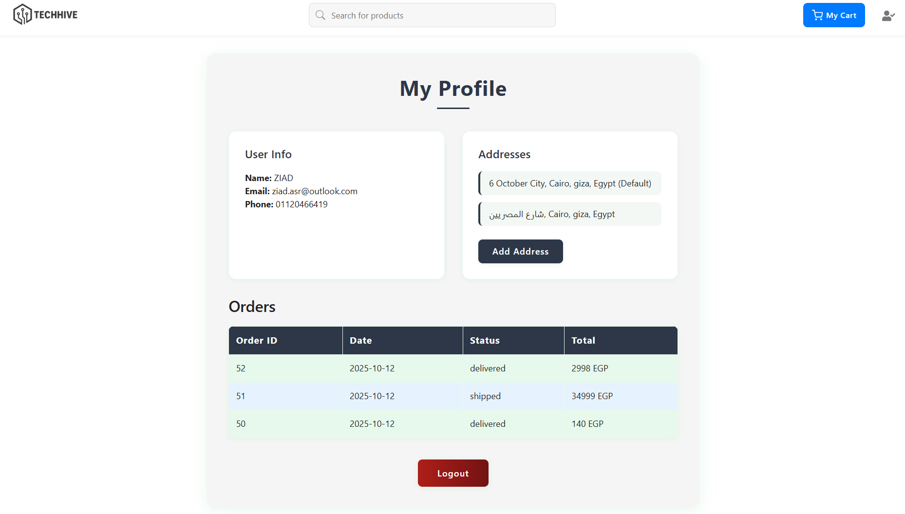
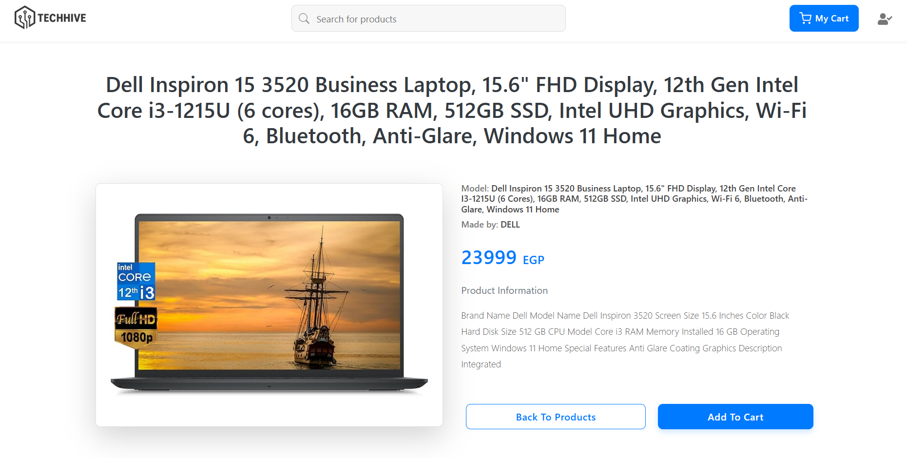

# 🚀 TECHHIVE-Ecommerce

[](https://www.typescriptlang.org/)
[](https://reactjs.org/)
[](https://nodejs.org/)
[](https://www.postgresql.org/)
[](LICENSE)

A robust, full-stack e-commerce web application built with a modern React/Node.js/PostgreSQL architecture, all powered by **TypeScript**.

---

## 💡 Overview

**TechHive** is a full-stack e-commerce platform that allows users to register, verify their accounts via email, and start shopping instantly.

Customers can browse products, create and track their orders, and view their order history in real time. An integrated admin dashboard enables store managers to view all orders, update their statuses, and monitor live order creation events through **real-time tracking (Socket.io)**.

---

## ✨ Features

- **Full Authentication System:** User registration, login, email verification, password changing ,and secure session handling.
- **Shopping & Orders:** Browse products, add to cart, place orders, and view past purchases.
- **Order Management:** Track the current state of each order (e.g., pending, processing, delivered).
- **Email Notifications:** Automated email updates for account and order events.
- **Admin Dashboard:** Manage products, view all users, and monitor order creation in real time through **WebSockets (Socket.io)**.

---

## 🛠️ Tech Stack

| Component     | Technology          | Version / Notes                                        |
| :------------ | :------------------ | :----------------------------------------------------- |
| **Language**  | **TypeScript**      | Used across both Frontend and Backend for type safety. |
| **Frontend**  | React, Bootstrap    | Modern UI with a responsive design library.            |
| **Backend**   | Node.js, Express.js | Fast, unopinionated server environment.                |
| **Database**  | PostgreSQL          | Robust and scalable relational database.               |
| **Real-time** | Socket.io           | Used for live admin dashboard updates.                 |

---

## 🚀 Getting Started: Setup and Installation

### Prerequisites

You must have the following installed locally:

- **Node.js** (v18.x or higher)
- **PostgreSQL** (running locally or accessible via network)
- **npm** or **Yarn**

### Installation Steps

1.  **Clone the Repository**

    ```bash
    git clone [https://github.com/your-username/TechHive-Ecommerce.git](https://github.com/your-username/TechHive-Ecommerce.git)
    cd TechHive-Ecommerce
    ```

2.  **Database & Backend Setup**

    - Create a new PostgreSQL database (e.g., `techhive_db`).
    - Navigate to the `backend` directory.
    - Install dependencies, then run database migrations and seeding (if applicable):

    ```bash
    cd backend
    npm install

    ```

3.  **Environment Variables**

    - Create a `.env` file in the `backend` folder based on the provided `.env.example`. This file requires your database credentials and email service (SMTP) details.

4.  **Frontend Setup**

    - Install dependencies:

    ```bash
    cd ../frontend or in the root directory
    npm install
    ```

5.  **Start the Servers**
    - In one terminal, start the backend:
    ```bash
    cd backend
    npm start
    ```
    - In a second terminal, start the frontend:
    ```bash
    cd frontend
    npm start
    ```

---

## 🎬 Usage

The frontend application will typically open in your browser at **`http://localhost:3000`** (or another port specified by your frontend framework).

1.  **Initial Access:** Navigate to the URL and register a new user account.
2.  **Email Verification:** Check your email (or logs if using a development SMTP service like Mailtrap) to verify your account.
3.  **Start Shopping:** Log in, browse the product catalog, add items to your cart, and place a test order.
4.  **Admin View:** Access the admin dashboard (usually at `/admin` route) to manage the orders you just created.

5.  **to use the admin features** use the hardcoded function in admins controller to regester the admin into your new database

## 📸 Screenshots

|                     Homepage Screenshot                      |                    Admin Dashboard                     |
| :----------------------------------------------------------: | :----------------------------------------------------: |
|  |  |
|                         User Profile                         |                    Product Details                     |
|                 |           |

---

## 🤝 Contributing

Pull requests are welcome. For major changes or new feature proposals, please open an issue first to discuss what you would like to change.

## ⚖️ License

This project is licensed under the **MIT License** - see the `LICENSE` file for details.

## 🙏 Acknowledgment

This project was initially based on an open-source template available on GitHub. Since then, the codebase has been **heavily modified, refactored, and expanded** — including major upgrades to functionality, architecture, and design.

All logic, backend systems, and UI/UX improvements have been rewritten and customized for **TechHive** by [@ziadasr](https://github.com/ziadasr).
